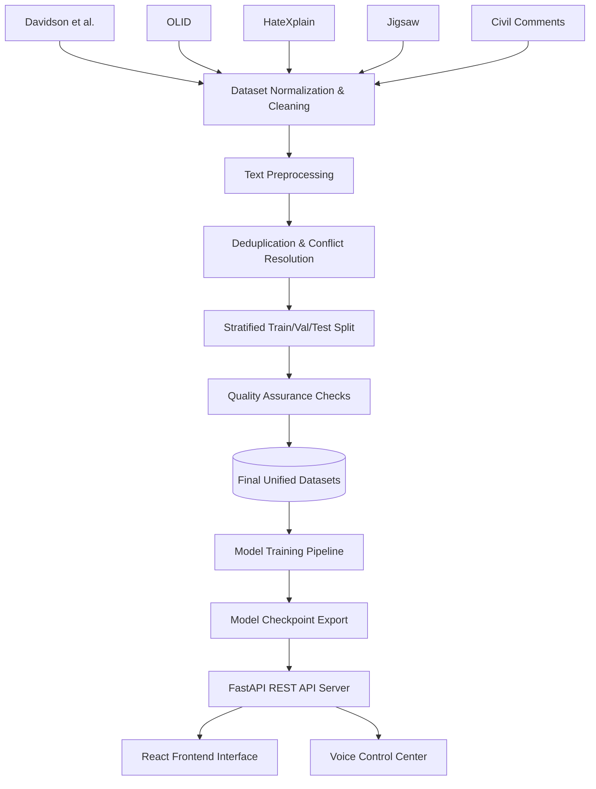

# Project Definition Proposal: Advanced Hate Speech Detection System
**Using Transformer-based Natural Language Processing**

---

## 1. Executive Summary

This proposal outlines the technical specifications, architectural design, and implementation roadmap for an **Advanced Hate Speech Detection System**. Leveraging state-of-the-art Transformer-based NLP models (such as `distilbert-base-uncased`, `roberta-base`, and `microsoft/deberta-v3-large`), the system classifies web-scale comment data into three unified categories: **Safe**, **Offensive**, and **Hate Speech**. 

The solution provides a complete production-ready lifecycle: from a multi-dataset preprocessing and merging pipeline to cost-sensitive model training, explainable inference (using attention weight extraction and SHAP), a FastAPI REST gateway, a speech-enabled command shell, and a modern React/Vite dashboard web interface.

---

## 2. Problem Statement & Motivation

Online platforms process millions of user-generated comments daily. Manual moderation is slow, costly, and emotionally draining. Traditional rule-based or TF-IDF machine learning approaches fail to grasp context, sarcasm, and subtle linguistic cues, resulting in high false-positive rates for non-toxic slang and high false-negative rates for adversarial hate speech.

Furthermore, hate speech datasets are highly imbalanced, domain-specific, and annotated under varying guidelines. To build a robust classifier, we must:
1. **Unify Fragmented Resources**: Standardize annotations across five distinct benchmark datasets.
2. **Mitigate Class Imbalance**: Prevent the model from ignoring the minority class (Hate Speech) by employing cost-sensitive learning.
3. **Ensure Transparency (XAI)**: Demystify transformer classifications using explainable AI to prevent biased moderation decisions.
4. **Deploy with Low Latency**: Minimize inference times for real-time applications.

---

## 3. Core Objectives & Scope

### In-Scope
* **Robust Preprocessing**: Multi-stage pipeline handling emojis, URLs, camel-case hashtags, HTML, and duplicates.
* **Dataset Unification**: Programmatic downloading, label merging, deduplication, conflict resolution, and quality verification of 5 source datasets.
* **Transformer Optimization**: Training DistilBERT/RoBERTa/DeBERTa models via PyTorch/Hugging Face, with automated hyperparameter tuning.
* **Explainable AI (XAI)**: Visualizing model focus via attention highlights and SHAP values.
* **Production Deployment**: A REST API with latency tracking and a responsive React frontend.
* **Voice Control**: Voice-activated input (STT) and voice feedback (TTS) capabilities.

### Out-of-Scope
* Active moderator review workflows (ticketing, escalation).
* Database clustering or distributed horizontal scaling.
* Fine-tuning multi-modal inputs (e.g., image-text combinations).

---

## 4. Pipeline Architecture & Data Flow

Below is the conceptual architecture of the modular processing pipeline:



### 4.1. Source Datasets & Label Mapping
We resolve annotation differences across 5 distinct corpora into a unified label space:
* **0 (Safe)**: Clean, non-toxic text.
* **1 (Offensive)**: Generic profanity, crude remarks, or generic toxicity without targeting specific groups.
* **2 (Hate Speech)**: Insults, threats, or demeaning statements targeted at protected classes (race, gender, sexual orientation, disability, religion).

| Source Dataset | Original Classes | Unified Target Category |
| :--- | :--- | :--- |
| **Davidson et al.** | `0 (hate)` / `1 (offensive)` / `2 (neither)` | **Hate Speech** (2) / **Offensive** (1) / **Safe** (0) |
| **OLID (Subtask A)** | `OFF (offensive)` / `NOT (not offensive)` | **Offensive** (1) / **Safe** (0) |
| **HateXplain** | `hatespeech` / `offensive` / `normal` | **Hate Speech** (2) / **Offensive** (1) / **Safe** (0) |
| **Jigsaw** | Multi-label toxicity flags | Severity mapping (Toxicity/Threats $\ge 0.5$ $\rightarrow$ Hate Speech/Offensive) |
| **Civil Comments** | Fraction-based toxicity rates | Score-based threshold mapping (Toxicity $\ge 0.5$ $\rightarrow$ Hate Speech/Offensive) |

### 4.2. Advanced Text Preprocessing
Raw inputs undergo sequential sanitization in `preprocessing.py`:
1. **HTML/Markdown Stripping**: Removing structural tags and code block residuals.
2. **URL & Email Redaction**: Replacing web links and email addresses with standard placeholders (`[URL]`, `[EMAIL]`).
3. **Hashtag Decomposition**: Splitting `#StopAsianHate` into `Stop Asian Hate` using camel-case parsing.
4. **Emoji Translation**: Converting emojis (e.g., 😠 $\rightarrow$ `[angry_face]`) using the `emoji` library to capture sentiment.
5. **Unicode Normalization**: Canonical decomposing (NFKD) to clean obfuscated characters (e.g., `H⍺te` $\rightarrow$ `Hate`).
6. **Whitespace Consolidation**: Compressing tabs, newlines, and double spaces.

---

## 5. Model Training & Optimization Strategy

The system relies on PyTorch and the Hugging Face `transformers` environment.

### 5.1. Model Lineup
* **DistilBERT** (`distilbert-base-uncased`): Default baseline. Offers high inference throughput on CPU deployments with a small memory footprint.
* **RoBERTa** (`roberta-base`): Intermediate candidate with robust pre-training on larger web corpora.
* **DeBERTa-v3** (`microsoft/deberta-v3-large`): High-accuracy option utilizing disentangled attention, yielding optimal F1 scores.

### 5.2. Class Imbalance Mitigation
Since *Hate Speech* is typically a minority class, standard cross-entropy loss causes the model to favor the *Safe* class. We apply **inverse class frequency weighting** in the training loss function:

$$w_c = \frac{N}{C \times N_c}$$

Where $N$ is the total dataset size, $C$ is the number of classes, and $N_c$ is the sample count for class $c$. These computed weights are supplied directly to `CrossEntropyLoss` during optimization.

### 5.3. Hyperparameter Tuning
Before training the final model, a grid search is executed over a sub-sampled partition to discover the best hyperparameter configuration maximizing **Macro F1 Score**:
* **Learning Rates**: $[1\text{e-}5, 2\text{e-}5, 3\text{e-}5]$
* **Batch Sizes**: $[16, 32]$
* **Weight Decay**: $[0.01, 0.1]$
* **Early Stopping**: Triggered after $N$ consecutive evaluation steps without validation F1 improvement.

---

## 6. Inference, Explainable AI, & Voice Interfaces

### 6.1. REST API Architecture (FastAPI)
The FastAPI backend (`app.py`) provides sub-millisecond route resolution:
* `GET /health`: Verifies status, hardware allocation (CPU/CUDA), and model availability.
* `GET /model-info`: Returns model configuration details (max tokens, dropout, vocabulary name).
* `POST /predict`: Analyzes a single string and returns class labels, raw probabilities, and processing time.
* `POST /batch-predict`: Executes vectorized inference on batches of text for maximum throughput.

### 6.2. Explainable AI (XAI)
To establish trust, predictions display detailed metrics explaining the classification:
1. **Self-Attention Visualizations**: Extracting and rendering token-to-token attention weights from the final encoder layer.
2. **SHAP (SHapley Additive exPlanations)**: Computing additive feature attributions for individual words to quantify their contribution to the predicted class.

### 6.3. Voice Interface
A terminal-based interface (`voice.py`) allows hands-free evaluation:
* **Speech-to-Text (STT)**: Accepts verbal inputs via `speech_recognition` (Google Web Speech API or local fallback).
* **Text-to-Speech (TTS)**: Reads out labels and prediction confidence values via the `pyttsx3` voice synthesizer.

---

## 7. Frontend Interface Design

The UI is built with React, TypeScript, and Vite, utilizing a sleek **dark-mode editorial design system** inspired by the Cohere brand (stark backgrounds, thin rules, deep green accents, and rounded cards):

* **Prediction Dashboard (Sandbox)**: Live evaluation panel with confidence meters, self-attention highlighting, and processing speed logs.
* **Batch Processor**: Interface for uploading datasets or multiple statements to evaluate at once, showing aggregation statistics.
* **History Logs**: Interactive table showing past evaluations, allowing search, filtering by classification, and exporting results.
* **Model Statistics**: Renders pre-generated evaluation plots (confusion matrix, ROC/PR curves) and classification reports.
* **System Settings**: Allows configuring local thresholds, toggling voice control options, and viewing environment configurations.

---

## 8. Performance Evaluation Metrics

Models are evaluated on a holdout test split (10% of total data) using:

1. **Macro F1 Score** (Primary Metric): Combines precision and recall globally across all classes without letting the majority class dominate the score.
2. **Precision & Recall**: Tracked individually for each class to avoid excessive false positives (flagging safe text as offensive) or false negatives (letting hate speech slip through).
3. **Confusion Matrix**: A $3\times3$ grid outlining true vs. predicted counts.
4. **Confidence-Sorted Error Log**: Saves a CSV recording misclassified examples with high confidence scores, highlighting complex boundary cases for active learning.

---

## 9. Key Deliverables & Delivery Roadmap

```
Stage 1: Ingestion & Pipelines  --->  Stage 2: Model Training & Tuning  --->  Stage 3: Gateway & UI Integration  --->  Stage 4: Quality Assurance & Launch
- Merging 5 source datasets          - Grid search hyperparameters         - FastAPI endpoint deployment         - Validation split testing
- Normalization & deduplication      - Cost-sensitive training (weights)   - React visualization dashboard       - Error log evaluation
- cleaning verification reports      - Save best checkpoints               - Speech-recognition module           - Production build optimization
```

---
*End of Proposal.*
