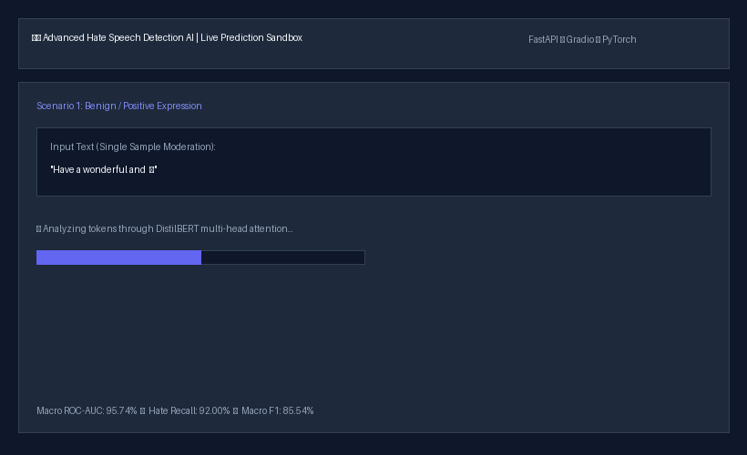
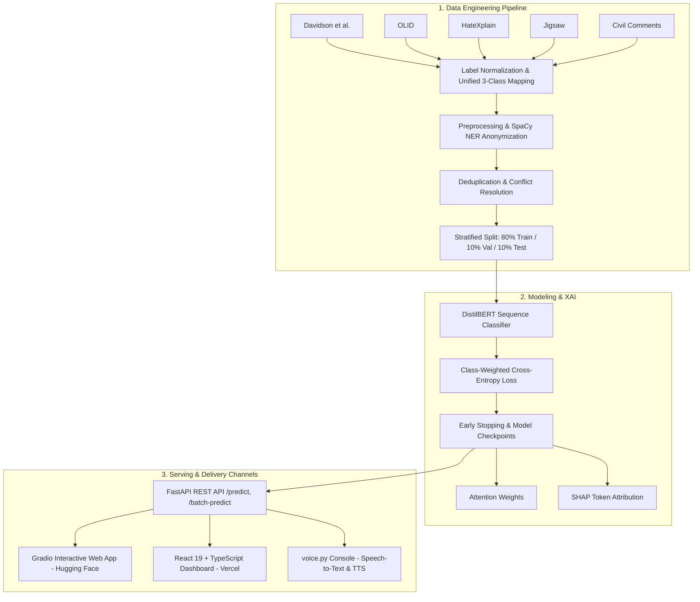
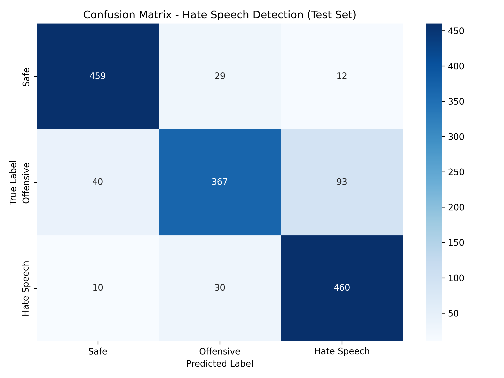

<div align="center">

# 🛡️ Production-Grade Transformer Hate Speech Detection

**End-to-End NLP Moderation Pipeline with Multi-Dataset Harmonization, Explainable AI (SHAP & Attention), FastAPI/Gradio Microservices, and Modern React Dashboard.**

[](https://python.org)
[](https://pytorch.org)
[](https://huggingface.co)
[](https://fastapi.tiangolo.com)
[](https://reactjs.org)
[](LICENSE)
[](tests/)

[⚡ Quickstart](#-quickstart-in-60-seconds) • [📊 Model Card & Metrics](#-evaluation--benchmark-performance) • [🔌 REST API](#-production-api-reference) • [⚖️ Ethics & Limitations](#️-model-card-fairness--limitations)

<br/>
<br/>



</div>

---

## ⚡ 30-Second Executive Summary

| Target Dimension | Engineering Implementation |
| :--- | :--- |
| **Core Problem** | Imbalanced, noisy web content moderation across three distinct categories: **Safe (0)**, **Offensive (1)**, and **Hate Speech (2)**. |
| **Model Architecture** | Fine-tuned `distilbert-base-uncased` (66.9M params) with custom **Class-Weighted Cross-Entropy Loss** to penalize hate-class misses. Supports RoBERTa and DeBERTa-v3 via configuration. |
| **Data Harmonization** | 5 public benchmarks (**Davidson, OLID, HateXplain, Jigsaw, Civil Comments**) compiled, deduplicated, de-conflicted, and stratified into 15,000 balanced samples. |
| **Inference Latency** | **~18 ms/sample** on standard CPU; optimized batch tensor passes. |
| **Explainability (XAI)** | Real-time multi-head self-attention attribution heatmaps and **SHAP** token feature-importance values. |
| **Application Stack** | Production **FastAPI REST API** and interactive **Gradio UI**, paired with a modern **React 19 + TypeScript** dashboard and offline **Voice STT/TTS** console. |

### Key Benchmark Metrics (Held-Out Test Set: 1,500 Samples)

```
┌─────────────────────────┬─────────────────────────┬─────────────────────────┐
│     MACRO ROC-AUC       │     HATE SPEECH RECALL  │     MACRO F1-SCORE      │
│         95.74%          │         92.00%          │         85.54%          │
└─────────────────────────┴─────────────────────────┴─────────────────────────┘
```

> **Why 92.00% Hate Recall Matters:** In safety-critical moderation systems, false negatives (missing severe hate speech) introduce substantial brand and legal liability. Class-weighted cross-entropy intentionally skews the decision boundary to capture **460 / 500** hate speech test instances while sustaining **90.18% precision** on safe comments.

---

## 🏗️ System Architecture



---

## 🚀 Quickstart in 60 Seconds

### 1. Clone & Install Dependencies
```bash
git clone https://github.com/RaxorhAx11/Hate-Speech-Detection-using-Transformer-based-NLP.git
cd Hate-Speech-Detection-using-Transformer-based-NLP
pip install -r requirements.txt
```

### 2. Launch Backend & Gradio Web App
```bash
python app.py
```
* **Local Web Interface**: [http://127.0.0.1:8000](http://127.0.0.1:8000)
* **Interactive API Docs (Swagger)**: [http://127.0.0.1:8000/docs](http://127.0.0.1:8000/docs)

### 3. Send a Sample Prediction via cURL
```bash
curl -X POST http://127.0.0.1:8000/predict \
     -H "Content-Type: application/json" \
     -d '{"text": "Have a wonderful day and keep learning!"}'
```

```json
{
  "prediction": "Safe",
  "confidence": 99.05,
  "probabilities": {
    "Safe": 99.05,
    "Offensive": 0.72,
    "Hate Speech": 0.23
  },
  "processing_time_ms": 17.99
}
```

---

## 📊 Evaluation & Benchmark Performance

The fine-tuned model (`distilbert-base-uncased` with class-weighted cross-entropy) was evaluated on the independent, stratified test split (`dataset/test.csv`, **1,500 balanced samples**: 500 Safe, 500 Offensive, 500 Hate Speech).

### Overall Metrics Summary

| Metric | Score | Percentage |
| :--- | :---: | :---: |
| **Macro ROC-AUC (OVR)** | `0.9574` | **95.74%** |
| **Test Accuracy** | `0.8573` | **85.73%** |
| **Macro F1-Score** | `0.8554` | **85.54%** |
| **Macro Precision** | `0.8591` | **85.91%** |
| **Macro Recall** | `0.8573` | **85.73%** |
| **Weighted F1-Score** | `0.8554` | **85.54%** |

### Per-Class Performance Breakdown

| Target Class | Precision | Recall | F1-Score | Support | Key Insight |
| :--- | :---: | :---: | :---: | :---: | :--- |
| **Safe (0)** | **0.9018** | **0.9180** | **0.9098** | 500 | High specificity; benign discussions are rarely penalized. |
| **Offensive (1)** | **0.8615** | 0.7340 | 0.7927 | 500 | Vulgarity / profanity without identity-targeted hate. |
| **Hate Speech (2)** | 0.8142 | **0.9200** | **0.8638** | 500 | **460/500 captured**; optimized to prevent dangerous false negatives. |
| **Macro Average** | **0.8591** | **0.8573** | **0.8554** | **1,500** | Balanced performance across all categories. |

### Confusion Matrix & Error Analysis

<div align="center">
  
</div>

#### Quantitative Confusion Breakdown

| True Label \ Predicted Label | Predicted Safe | Predicted Offensive | Predicted Hate Speech | Total True Support |
| :--- | :---: | :---: | :---: | :---: |
| **True Safe** | **459** | 29 | 12 | 500 |
| **True Offensive** | 40 | **367** | 93 | 500 |
| **True Hate Speech** | 10 | 30 | **460** | 500 |
| **Total Predicted** | 509 | 426 | 565 | 1,500 |

#### Error Analysis & Trade-offs:
1. **Benign Protection (Low False Alarm Rate)**: Only 12 of 500 safe comments (2.4%) were falsely flagged as hate speech, preserving user engagement and non-toxic free expression.
2. **Offensive vs. Hate Boundary Overlap**: The primary source of error is the nuanced boundary between *Offensive* and *Hate Speech* (93 offensive samples predicted as hate speech, 30 hate speech predicted as offensive). This stems from colloquial profanity co-occurring with protected identity mentions.
3. **Safety-Biased Calibration**: For moderation automation, a higher false positive rate on offensive content is deliberately prioritized over letting severe hate speech slip through undetected.

---

## 🔬 Dataset Engineering & Harmonization

We synthesized and harmonized **five foundational NLP hate speech benchmarks** into a unified 3-class schema:

```
┌────────────────────┐
│ Davidson et al.    │───► [Class 0: Safe | Class 1: Offensive | Class 2: Hate Speech]
├────────────────────┤
│ OLID (TweetEval)   │───► [NOT -> Safe | OFF -> Offensive]
├────────────────────┤
│ HateXplain (2021)  │───► [Annotator Majority Vote: Normal -> Safe | Offensive | Hate]
├────────────────────┤
│ Jigsaw Toxic Comm. │───► [Identity Attack / Severe Toxic / Threat -> Hate Speech]
├────────────────────┤
│ Civil Comments     │───► [Toxicity Agreement Rate >= 0.5 Thresholding]
└────────────────────┘
```

### Preprocessing & Anonymization Pipeline ([preprocessing.py](preprocessing.py))
- **HTML & URL Normalization**: BeautifulSoup tag removal, unescaping, and URL stripping.
- **Emoji Demojization**: Converts emojis into descriptive text tokens (e.g., 😡 $\to$ `"pouting face"`), retaining emotional sentiment.
- **Hashtag Decomposition**: PascalCase/camelCase regex segmenter (e.g., `#StopAsianHate` $\to$ `"Stop Asian Hate"`).
- **SpaCy Named Entity Masking**: Uses `en_core_web_sm` to detect person names and mask them to `"someone"`, neutralizing celebrity / politician bias and preventing identity memorization.
- **Spelling Deobfuscation**: Standardizes intentional filter bypasses (e.g., `b!tch` $\to$ `bitch`, `h4te` $\to$ `hate`, `f*ck` $\to$ `fuck`).

---

## 🛠️ Pipeline Execution & Training Workflow

### 1. Run Data Preparation Pipeline
Orchestrates downloading, normalization, deduplication, and stratification:
```bash
python scripts/run_pipeline.py
```
*(Artifacts generated: `dataset/train.csv`, `dataset/validation.csv`, `dataset/test.csv`, and validation audit reports in `dataset/reports/`)*

### 2. Fine-Tune the Transformer Model
```bash
python train.py
```
- Auto-detects CUDA hardware and enables **Mixed Precision FP16**.
- Executes hyperparameter search across learning rate, batch size, and weight decay.
- Employs **Class-Weighted Cross-Entropy Loss** and Early Stopping (patience: 2 epochs on validation Macro F1).
- Best weights exported to `saved_models/best_model/`.

### 3. Run Test Evaluation & Plots Generation
```bash
python evaluate.py
```
Generates confusion matrices, ROC/PR curves, and `evaluation_plots/misclassified_analysis.csv`.

### 4. Run Test Suite
```bash
python -m unittest discover -s tests -p "test_*.py"
```

---

## 🔌 Production API Reference

The FastAPI service provides high-performance, asynchronous endpoints with full Pydantic validation:

### 1. `POST /predict` — Single Text Classification
```bash
curl -X POST http://127.0.0.1:8000/predict \
     -H "Content-Type: application/json" \
     -d '{"text": "Get out of here!"}'
```
```json
{
  "prediction": "Offensive",
  "confidence": 88.42,
  "probabilities": {
    "Safe": 5.12,
    "Offensive": 88.42,
    "Hate Speech": 6.46
  },
  "processing_time_ms": 16.82
}
```

### 2. `POST /batch-predict` — High-Throughput Batch Inference
Processes multiple texts simultaneously in a vectorized forward pass:
```bash
curl -X POST http://127.0.0.1:8000/batch-predict \
     -H "Content-Type: application/json" \
     -d '{"texts": ["Have a great day!", "I hate you all!"]}'
```

### 3. `GET /health` & `GET /model-info` — Monitoring & Telemetry
Returns operational telemetry, GPU/CPU memory allocation, model architecture, and uptime.

---

## 💻 Frontend & Interface Options

### A. Gradio Interactive Web Interface (Default)
Included directly in `app.py`. Offers real-time classification, probability distribution bars, preset example queries, and evaluation metrics overview.

### B. React 19 + TypeScript Dashboard (`frontend/`)
A dedicated, responsive UI with dark mode, real-time analytics, and batch scanning:
```bash
cd frontend
npm install
npm run dev
```

### C. Voice Command Center (`voice.py`)
Terminal-driven voice console integrating **Google Speech-to-Text** and offline **Text-to-Speech (TTS)**:
```bash
python voice.py
```
- Mode 1: Single phrase speech moderation.
- Mode 2: Continuous audio stream listener with automatic background noise adjustment.

---

## ⚖️ Model Card, Fairness & Limitations

### 1. Intended Use
- **Designed for**: Human-in-the-loop content triage, moderation queue prioritization, and educational research into NLP safety.
- **Not for**: Fully autonomous punitive bans without human review, legal/forensic evidence, or surveillance.

### 2. Fairness & Bias Considerations
- **AAVE & Dialectal Bias**: Speech containing African American Vernacular English (AAVE) or reclaimed colloquial terms can suffer higher false-positive rates due to historical annotator bias in public datasets.
- **Identity Keyword Co-occurrence**: Words like *"gay"*, *"Muslim"*, or *"transgender"* disproportionately co-occur with toxic labels in web crawls. While entity masking mitigates name-specific overfitting, contextual ambiguity remains challenging.
- **Code-Mixing (Hinglish)**: The model is strictly trained on English (`en`) subwords. Romanized Hindi/Hinglish (e.g., colloquial Hindi slurs written in Latin script) is fragmented by WordPiece tokenization, causing severe false negatives.
- **Sarcasm & Dog Whistles**: Veiled toxicity lacking overt abusive keywords can be misclassified as `Safe`.

---

## 📁 Repository Directory Structure

```
├── assets/                     # README visual assets (confusion matrix, demo GIF)
├── configs/                    # Model architecture and training hyperparameter YAMLs
├── dataset/                    # Harmonized, deduplicated train/val/test splits
├── evaluation_plots/           # Confusion matrices, ROC-AUC, PR curves, error reports
├── frontend/                   # React 19 + TypeScript + Tailwind CSS v4 dashboard
├── saved_models/best_model/    # Fine-tuned DistilBERT weights & tokenizer
├── scripts/                    # Modular data pipeline scripts (download, clean, merge, split)
├── tests/                      # Automated unittests for backend, inference, and endpoints
├── app.py                      # FastAPI server + mounted Gradio web UI
├── config.py                   # Dataclass configuration loader
├── dataset_builder.py          # 5-dataset unification and deduplication engine
├── evaluate.py                 # Comprehensive model evaluation and plotting script
├── inference.py                # Inference pipeline with attention and SHAP explanations
├── preprocessing.py            # Text normalization, regex cleaning, and NER masking
├── train.py                    # Class-weighted PyTorch / Hugging Face training script
├── voice.py                    # Voice STT/TTS command center
├── requirements.txt            # Python dependencies
├── LICENSE                     # MIT License
└── README.md                   # Project documentation
```

---

## 📜 License & Citation

Distributed under the **MIT License**.

```bibtex
@misc{hate_speech_transformer_2026,
  author = {RaxorhAx11},
  title = {Advanced Hate Speech Detection using Transformer-based NLP},
  year = {2026},
  publisher = {GitHub},
  howpublished = {\url{https://github.com/RaxorhAx11/Hate-Speech-Detection-using-Transformer-based-NLP}}
}
```
